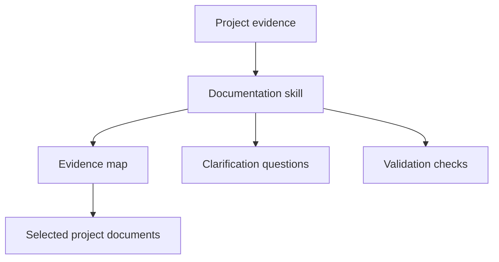

# Software Documentation Framework

An evidence-driven framework for creating, auditing, and maintaining software
project documentation alongside code and specifications.

The repository includes a reusable Codex skill, adaptable templates, a safe
project evidence collector, documentation standards, public-repository safeguards,
tests, and automated validation.

> License status: no open-source license has been selected yet. Public visibility
> does not grant permission to copy, modify, or redistribute the contents. The
> repository owner can use and evaluate the framework while a license decision is
> pending.

## Why this project exists

Software documentation often becomes incomplete, speculative, duplicated, or
detached from implementation. This framework addresses that problem through four
rules:

1. Inspect the project before drafting.
2. Separate confirmed facts, inferences, conflicts, and unknowns.
3. Keep specifications, implementation, tests, and documentation aligned.
4. Validate documentation with the strongest checks available in the project.

## What is included

- `document-software-project`, a reusable skill for ChatGPT and Codex
- a safe evidence collector that excludes actual secret files and values
- guidance for greenfield, brownfield, focused-update, and audit-only work
- framework-agnostic support for Spec Kit, OpenSpec, Kiro Specs, BDD, RFCs, and
  project-specific specification systems
- templates for READMEs, project overviews, feature specifications, architecture,
  ADRs, development, deployment, runbooks, and agent instructions
- public-repository safety rules
- tests and GitHub Actions validation
- detailed usage guides in English and Brazilian Portuguese

## How it works



The skill treats source code as evidence of current behavior, not automatic proof
of desired product intent. When authoritative sources conflict, it reports the
drift and asks which intent should win.

## Repository structure

```text
.
├── .agents/skills/document-software-project/
│   ├── SKILL.md
│   ├── agents/openai.yaml
│   ├── assets/templates/
│   ├── references/
│   └── scripts/
├── .github/
│   ├── ISSUE_TEMPLATE/
│   ├── workflows/validate.yml
│   └── pull_request_template.md
├── docs/
│   ├── adr/
│   ├── pt-BR/
│   ├── ARCHITECTURE.md
│   ├── METHODOLOGY.md
│   ├── PUBLIC-REPOSITORY-SAFETY.md
│   ├── USAGE.md
│   └── VALIDATION.md
├── scripts/validate_repository.py
├── tests/
├── AGENTS.md
├── CONTRIBUTING.md
└── SECURITY.md
```

## Quick start

### Option 1: use from Codex with the skill installer

Open the skill installer and ask it to install the skill from this path:

```text
$skill-installer
Install the document-software-project skill from
https://github.com/alessonviana/software-documentation-framework/tree/main/.agents/skills/document-software-project
```

The official Codex guidance supports installing skills from other repositories.

### Option 2: add the skill to one repository

Clone this framework, then copy the skill to the target project's repository scope:

```bash
git clone https://github.com/alessonviana/software-documentation-framework.git
mkdir -p path/to/target-project/.agents/skills
cp -R software-documentation-framework/.agents/skills/document-software-project \
  path/to/target-project/.agents/skills/
```

Codex discovers repository skills from `.agents/skills`.

### Option 3: add the skill to your user scope

```bash
mkdir -p "$HOME/.agents/skills"
cp -R software-documentation-framework/.agents/skills/document-software-project \
  "$HOME/.agents/skills/"
```

Codex also supports symlinked skill directories.

### Invoke the skill

```text
$document-software-project
Audit this repository and propose the smallest sufficient documentation set.
Do not modify files yet.
```

Or request a full baseline:

```text
$document-software-project
Inspect this project and create its documentation from zero. Ask before writing
anything that cannot be supported by project evidence.
```

## Direct evidence collection

The collector can be used without invoking the skill:

```bash
python3 .agents/skills/document-software-project/scripts/collect_project_evidence.py \
  --root /path/to/project \
  --format markdown
```

It inventories paths and safe variable names from example environment files. It
does not read values from actual `.env` files, private keys, credentials, or common
generated and vendored directories.

## Validate this repository

```bash
python3 scripts/validate_repository.py
python3 -m unittest discover -s tests -v
```

GitHub Actions runs the same checks for every push and pull request.

## Detailed documentation

- [English usage guide](docs/USAGE.md)
- [Guia detalhado em português](docs/pt-BR/GUIA-DE-USO.md)
- [Architecture](docs/ARCHITECTURE.md)
- [Methodology and sources](docs/METHODOLOGY.md)
- [Public-repository safety](docs/PUBLIC-REPOSITORY-SAFETY.md)
- [Validation](docs/VALIDATION.md)
- [Contributing](CONTRIBUTING.md)
- [Security policy](SECURITY.md)

## Foundation

The framework synthesizes common principles from:

- [Google Technical Writing: Organizing large documents](https://developers.google.com/tech-writing/two/large-docs)
- [Write the Docs Software Documentation Guide](https://www.writethedocs.org/guide/)
- [Docs for Developers: An Engineer's Field Guide to Technical Writing](https://link.springer.com/book/10.1007/979-8-8688-2509-5)
- [GitHub Spec Kit](https://github.github.com/spec-kit/)
- [OpenAI guidance for building skills](https://learn.chatgpt.com/docs/build-skills)

Only synthesized, original guidance is included. Source PDFs and book text are not
redistributed.
