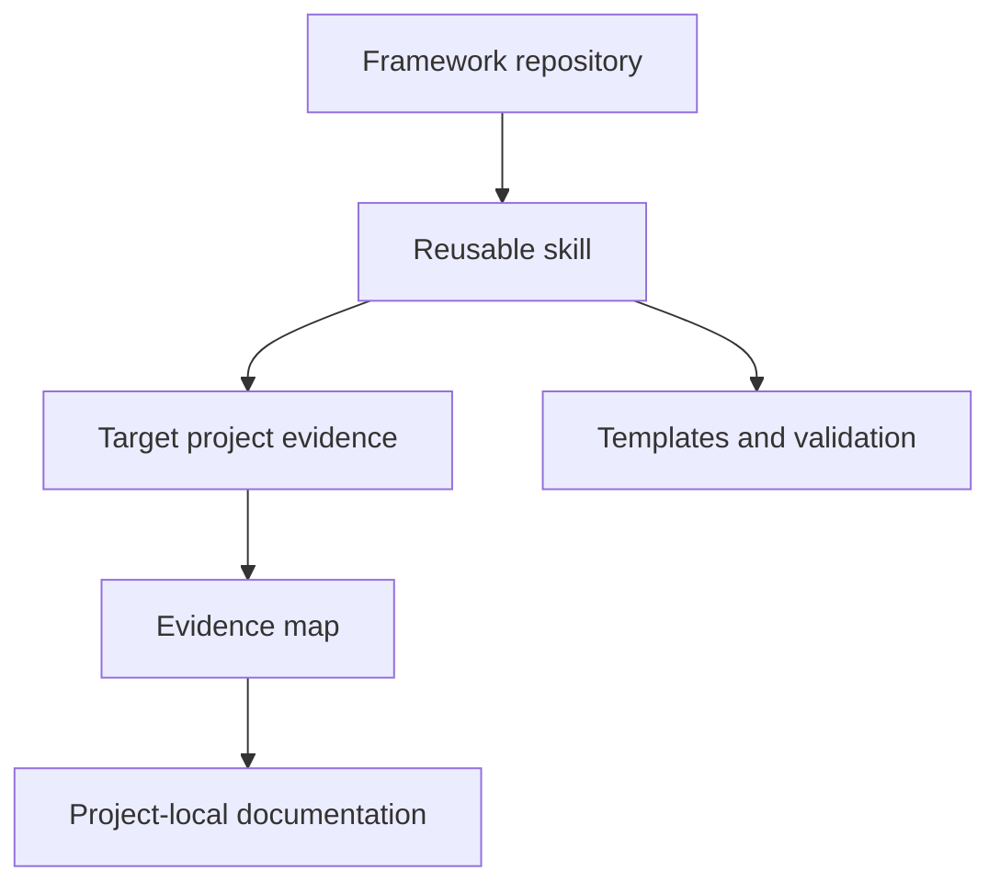

# Architecture

## Purpose and scope

This repository is a documentation framework, not a central store for the
project-specific truth of every software system. It distributes a reusable workflow
while keeping each target project's documentation beside its code.

## System context

## Components

| Component | Responsibility | Canonical path |
| --- | --- | --- |
| Skill workflow | Decide how to inspect, clarify, draft, and validate | `.agents/skills/document-software-project/SKILL.md` |
| Documentation standard | Define evidence, audience, writing, and maintenance rules | `.agents/skills/document-software-project/references/documentation-standard.md` |
| SDD alignment | Reconcile specifications, plans, tasks, tests, and implementation | `.agents/skills/document-software-project/references/spec-driven-development.md` |
| Template catalog | Select the smallest useful document set | `.agents/skills/document-software-project/references/document-templates.md` |
| Template assets | Provide adaptable starting files | `.agents/skills/document-software-project/assets/templates/` |
| Evidence collector | Inventory safe project signals without reading secret values | `.agents/skills/document-software-project/scripts/collect_project_evidence.py` |
| Repository validator | Check structure, links, public safety, and skill metadata | `scripts/validate_repository.py` |
| Tests | Verify deterministic behavior and secret exclusion | `tests/` |

## Data and trust boundaries

The evidence collector reads path names across a selected project and reads only
variable names from environment example files. Actual environment files, private
keys, common credential files, generated output, dependency trees, and symlinked
files are excluded.

The collector output is an inventory. It is not treated as proof of business intent.
The skill must read authoritative artifacts and ask when intent remains unknown.

## Design decisions

### Keep project truth with project code

The framework contains reusable standards and tools. A target project's README,
specifications, architecture, runbooks, and operational instructions remain in that
target repository.

See [ADR 0001](adr/0001-keep-project-truth-with-code.md).

### Publish synthesis, not source material

The framework includes original synthesis and direct public links. It excludes the
source PDFs and the book text used during research.

See [ADR 0002](adr/0002-publish-synthesis-not-source-material.md).

### Remain framework-agnostic

The skill detects an existing specification convention and preserves it. It does
not install or migrate Spec Kit, OpenSpec, Kiro Specs, BDD, or another framework
unless the user requests that change.

## Failure modes

| Failure | Required behavior |
| --- | --- |
| Product intent is missing | Ask or omit, never infer from code alone |
| Sources conflict | Produce a drift report and request a decision |
| Commands cannot be tested | State the verification limitation |
| Secret-like content is detected | Stop publication and report the exact file |
| A project has no need for a document type | Do not create an empty file |

## Known limitations

- The evidence collector performs static path-level discovery, not semantic proof.
- The framework cannot determine business intent without authoritative input.
- Tool-specific documentation builds and linters remain the responsibility of each
  target project.
- Public plugin packaging is not included in the initial repository structure.
